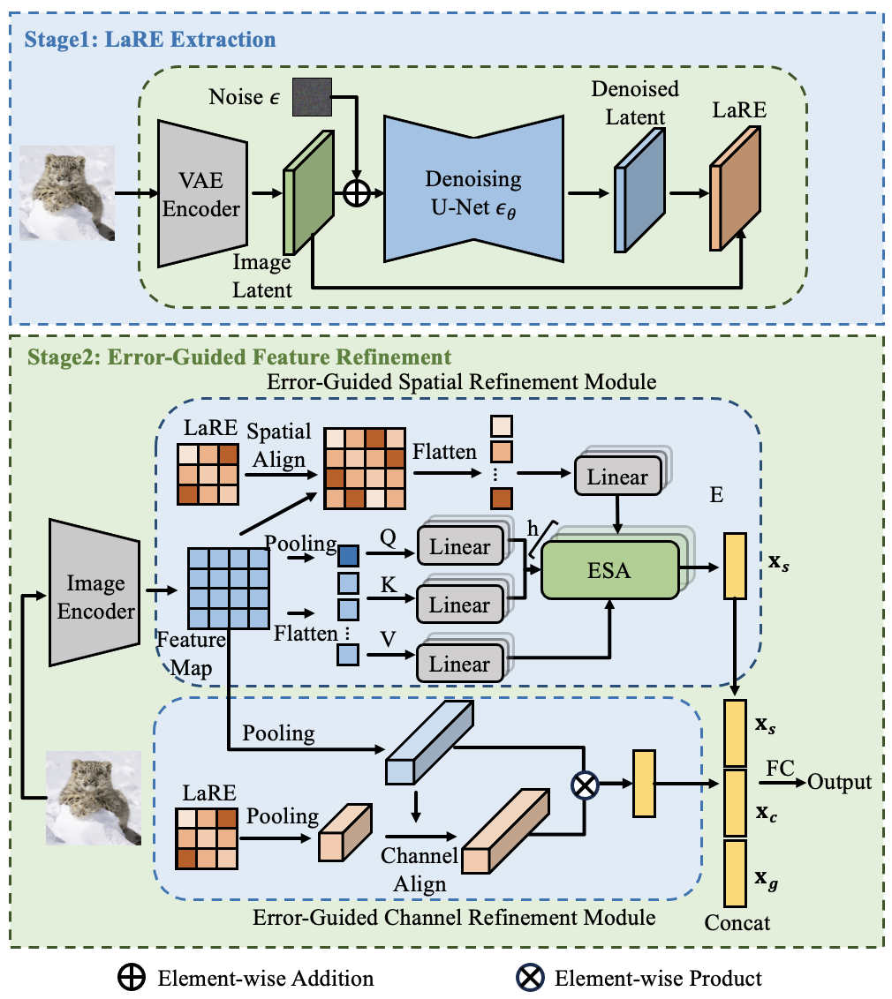

# LaRE
Official code for LaRE2: Latent Reconstruction Error Based Method for Diffusion-Generated Image Detection (CVPR 2024).
In this [paper](https://arxiv.org/pdf/2403.17465), we firstly propose the reconstruction error in latent space for generated-image 
detection. Compared with the existing method, we remarkably reduce the cost of feature extraction while preserving the essential information required for the
detection of diffusion-generated images.

<p align = "center">

</p>

## Environment Setup
For LaRE extraction, please refer to [DIFT](https://github.com/Tsingularity/dift). For model training, please refer to [LASTED](https://github.com/HighwayWu/LASTED)

## Dataset
We use GenImage as our dataset for training and evaluation. Please refer to [this repo](https://github.com/GenImage-Dataset/GenImage) 
for the dataset. After downloading the dataset, we create several annotation files for data loading.

Here is an example of `annotation/train_sdv5.txt`: 
```bash
/path/to/dataset/371_sdv5_00145.png 1
/path/to/dataset/n03594945_36929.JPEG 0
...
```

In this context, `1` represents an image generated by AIGC, while `0` signifies a real image.

## Usage
### stage1: LaRE extraction
```bash
bash extract_lare.sh
```
The extracted LaRE is stored as a *.pt file, bearing the same name as the input image.
Once LaRE extracted, we need a `map_file`. It contains all the absolute paths of LaRE. Here is the example:
```python
/path/to/features/3_adm_7.pt 1
/path/to/features/3_adm_34.pt 1
...
```

### stage2: Model training
```bash
bash train_classifier_wmap.sh
```

### stage3: Model test
```bash
bash test.sh
```

## TODO
- [x] Release code for feature extraction
- [x] Release code for model training

## Acknowledgments
* https://github.com/HighwayWu/LASTED
* https://github.com/Tsingularity/dift